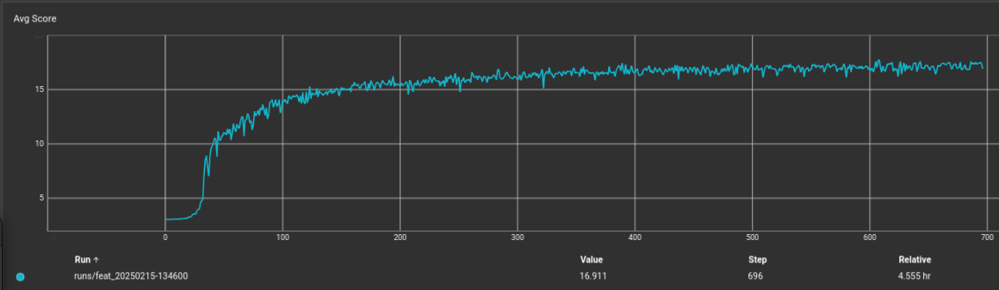
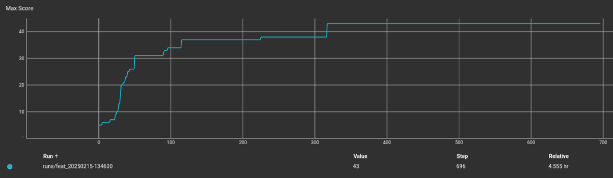
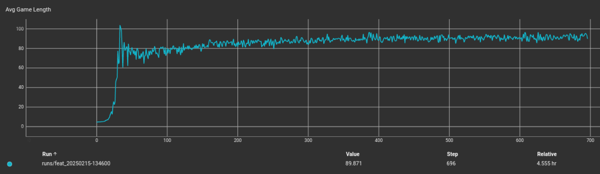

# Snake_AI
Snake envirnment and RL algorithms

## Features:
A set of 10 features (shown below) were used as input to the model. All features were normalized to [0, 1] by dividing by the length of the board.

[X Distance from Head to Fruit, 
Y Distance from Head to Fruit, 
Distance Up to Wall,
Distance Down to Wall,
Distance Left to Wall,
Distance Right to Wall,
Distance to Closest Body Up,
Distance to Closest Body Down,
Distance to Closest Body Left,
Distance to Closest Body Right]

## Rewards

The reward function consists of 3 parts. A positive reward for eating a fruit, a negative reward for dying, and a very small positive reward for staying alive each time step. Initially, a small negative reward was used for each time step to encourage faster completion. However, this was found to encourage the snake to kill itself quickly rather than spend many time steps trying to eat the fruit (at the start of training, the snake is very poor at this). A beta value of < 1 was used to discount future rewards.

## Advantage Actor Critic (A2C)

### Architecture

Both Actor and Critic share similar architectures. The 10 input features get sent through a feature extraction network prior to the Actor and Critic networks. The feature net uses 2 linear layers with ReLU activations. The Actor and Critic both use 2 additional linear layers with a ReLU after the first. The Actor network applies a terminal softmax activation to convert the action activations to probabilities. The Critic Net applys no activation function, allowing unbounded values.

## Training

### Learning Rates

For both actor and critic, an adam optimizer was used along with an exponentially decaying steped learning rate and minimum rate. This enabled faster training with a larger initial rate than what is usable durring later stages of training.

### Entropy Regularization

To encourage exploration and prevent premature convergence to suboptimal policies, entropy regularization was added to the loss function. This was implemented by incorporating an entropy term into the actor loss, scaled by beta. 

### Hyperparameters

| Parameter         | Value    |
|------------------|---------|
| `num_env`        | 1000    |
| `lr_actor`       | 3e-3    |
| `lr_critic`      | 5e-3    |
| `actor_step_size`| 20      |
| `critic_step_size`| 20     |
| `actor_gamma`    | 0.80    |
| `critic_gamma`   | 0.80    |
| `min_lr_actor`   | 2e-3    |
| `min_lr_critic`  | 2e-3    |
| `beta`           | 0.1     |
| `gamma`          | 0.98    |
| `rewards`        | [1, -1, 0.01] |
| `num_epochs`     | 1000    |
| `GAME_DIM`       | 10      |

### Sample Training Results

### Results

